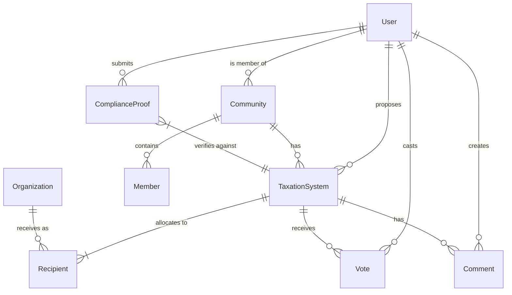

# 🐱 zkCATS (Zero Knowledge Community Autonomous Taxation System)

## Overview
A playful experiment in community-based contribution systems using zk-SNARKs!

In our feline community model, kitties want to pool their resources for the common good, but they're naturally private creatures who don't want other nosy cats peeking at their financial business. zkCATS lets these independent felines prove they've contributed their fair share to the community milk bowl, catnip garden, and scratching post maintenance fund - all without revealing their secret stashes of treats or mouse trophies!

This project uses Arkworks RS to implement zero-knowledge proofs, allowing our community cats to verify contributions while maintaining privacy.

## What is this really?
An educational/academic solo project to explore:
- zk-SNARKs implementation using Arkworks RS
- Smart contract development
- Community governance models
- Utopian ideas about decentralized resource allocation

Not intended for actual taxation or production use - just a sandbox for learning and imagination - the overall design will be adapted as I learn!

## Core Features
- Kitty-friendly interface for creating "milk fund" proposals
- zk-SNARK system using Arkworks RS to verify contributions while preserving privacy
- Voting system for democratic decision making (one cat, one vote)
- Community membership management
- Fun achievement badges for compliant community cats

## Technology Stack
- **Blockchain**: zkSync Era Testnet
- **ZK Framework**: Arkworks RS for zk-SNARK implementation
- **Smart Contracts**: Solidity
- **Backend**: Rust with Axum
- **Frontend**: Vue.js with cat-themed components
- **Development**: Hardhat for smart contract development

## System Architecture

### Zero-Knowledge Components (Using Arkworks RS)
- [ ] R1CS constraint system for proving contribution compliance
- [ ] Proving key and verification key generation
- [ ] Client-side zk-SNARK proof generation
- [ ] On-chain verification using Solidity

### Smart Contracts
- [ ] `CatCommunity.sol` - Manages the feline community
- [ ] `MilkFundProposal.sol` - For creating and voting on contribution models
- [ ] `CatComplianceVerifier.sol` - Verifies zk-SNARK proofs

### Rust Backend
- [ ] Arkworks RS integration for zk-SNARK setup and proof generation
- [ ] API endpoints for community management
- [ ] Database interactions using Diesel ORM
- [ ] zkSync interaction via web3 Rust library

## Entity Relationship Diagram



## zk-SNARK Circuit Design (Arkworks RS)

Our circuit will prove the following statement without revealing private information:
```
"I have contributed at least X amount total, distributed according to the percentages 
specified in the active MilkFund, from the Ethereum address I control"
```

The circuit will include:
- [ ] Verification of Ethereum address ownership (via signature)
- [ ] Summation of contributions to each recipient
- [ ] Verification of minimum contribution threshold
- [ ] Verification of proper distribution according to percentages

## Implementation Plan for zk-SNARKs with Arkworks RS

### Phase 1: zk-SNARK Learning & Setup
- [ ] Study Arkworks RS library components
- [ ] Set up development environment
- [ ] Create basic R1CS constraint system
- [ ] Generate proving and verification keys

### Phase 2: Circuit Implementation
- [ ] Implement constraint system for contribution verification
- [ ] Create proof generation functions
- [ ] Build verification system
- [ ] Test with sample data

### Phase 3: Smart Contract Integration
- [ ] Implement Solidity verifier contract
- [ ] Connect to community governance system
- [ ] Test verification on zkSync testnet

### Phase 4: User-Facing Components
- [ ] Create proof generation UI
- [ ] Implement compliance badge display
- [ ] Complete community management interface